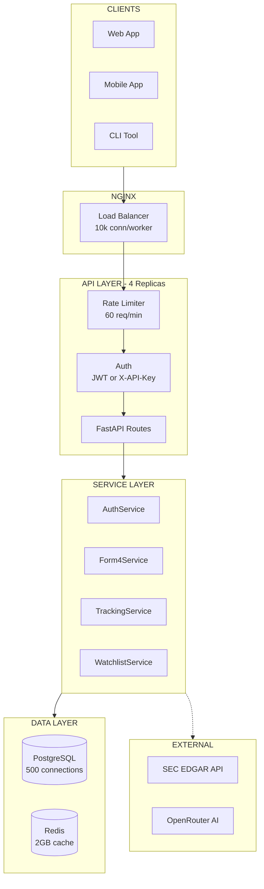
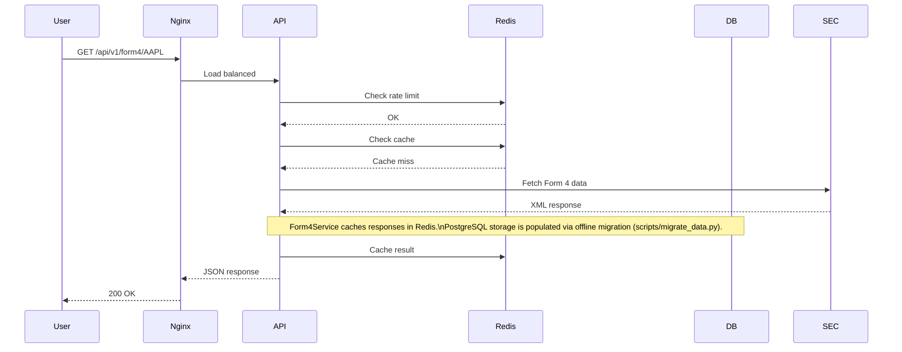

# SEC-Tracker v2.0 - Architecture Flow

## API Flow (Production)

## Request Flow

## Scaling Configuration

| Component | Setting | Handles |
|-----------|---------|---------|
| Nginx | 10k connections/worker | 40k+ concurrent users |
| API | 4 replicas, configurable DB pool | Horizontal scaling |
| PostgreSQL | 500 connections, 2GB cache | High throughput |
| Redis | 2GB LRU cache | Rate limiting + caching |

---

## Related Docs

- [README.md](README.md) - Quick start
- [WALKTHROUGH.md](WALKTHROUGH.md) - Full API reference
- [IMPLEMENTATION_PLAN.md](IMPLEMENTATION_PLAN.md) - Technical details
