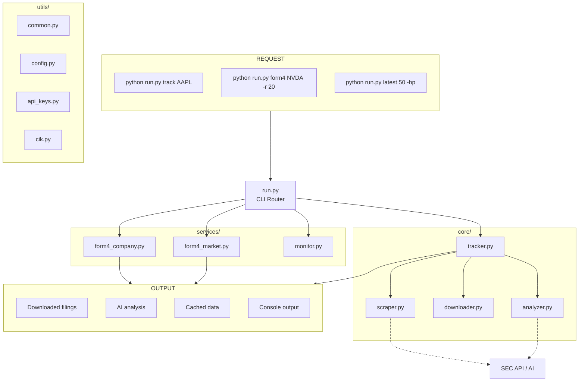

# SEC Filing Tracker - Flow

A concise, high-level flow diagram. For setup, commands, and integration details, see `README.md` and `WALKTHROUGH.md`.

## System Flow

## Related Docs

- `README.md` for quick start and commands
- `WALKTHROUGH.md` for integration and API formats

---

## License

MIT
