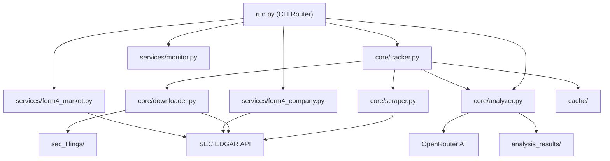

### SEC Filing Tracker

A modular Python service for monitoring, downloading, and AI‑analyzing SEC filings (10‑K, 10‑Q, 8‑K, Form 4).

## Quick Start

```bash
# Install
pip install -r requirements.txt

# Configure
cat << 'EOF' > .env
SEC_USER_AGENT=Your Name your@email.com
OPENROUTER_API_KEY=sk-or-v1-...
OPENROUTER_MODEL=deepseek/deepseek-chat-v3.1:free
EOF

# Run
python run.py track AAPL           # Track company filings
python run.py form4 NVDA -r 20     # Insider trading
python run.py latest 50            # Market-wide activity
python run.py                      # Show all commands
```

## Commands

| Command   | Module                      | Description                                 |
|-----------|-----------------------------|---------------------------------------------|
| `track`   | `core/tracker.py`           | **Main** - Fetch, download, analyze filings |
| `form4`   | `services/form4_company.py` | Company-specific insider trading            |
| `latest`  | `services/form4_market.py`  | Market-wide insider scanner                 |
| `analyze` | `core/analyzer.py`          | AI-powered filing analysis                  |
| `scan`    | `utils/cik.py`              | Ticker → CIK lookup                         |
| `monitor` | `services/monitor.py`       | System status dashboard                     |
| `model`   | (built-in)                  | AI model management                         |

## Repo Layout

```
SEC-Tracker/
├── core/       # Tracker, scraper, downloader, analyzer
├── services/   # Form 4 company + market, monitor
├── utils/      # Config, API keys, CIK, shared utilities
├── scripts/    # Cache refresh scripts
└── run.py      # CLI entry point
```

## Architecture (High-Level)



## Documentation

- **[FLOW.md](FLOW.md)** - System flow diagram (quick visual)
- **[WALKTHROUGH.md](WALKTHROUGH.md)** - Integration guide, API specs, Docker notes

## License

MIT
