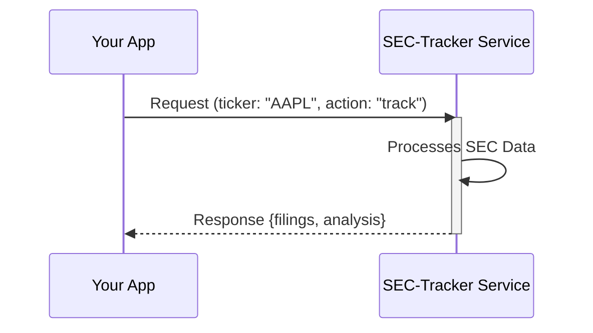
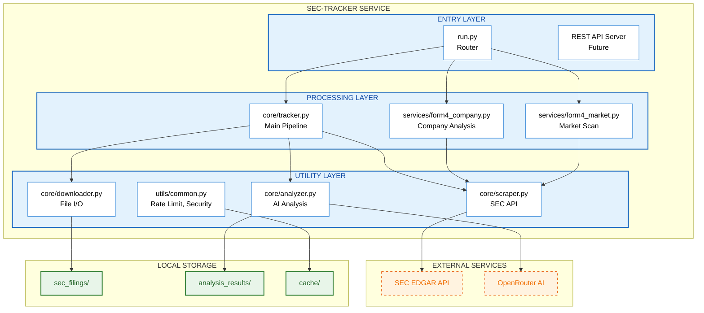
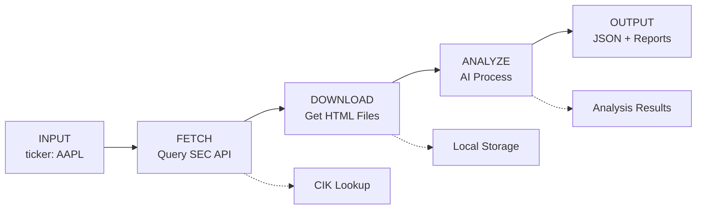
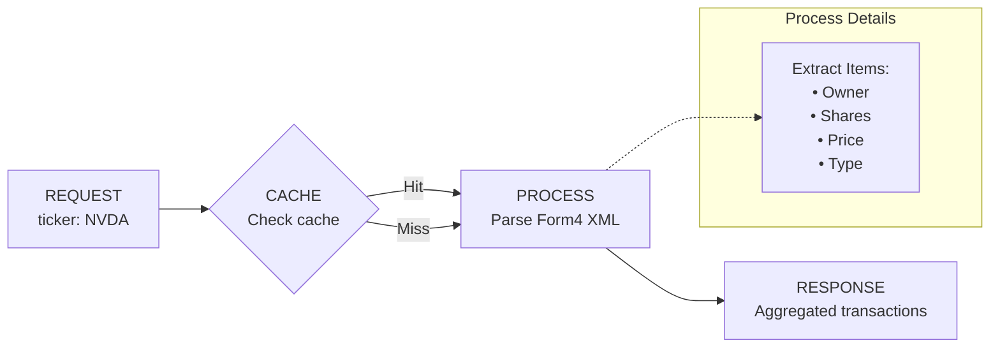

# SEC Filing Tracker - Technical Walkthrough

> **For Integration Partners**: This document explains how to integrate SEC-Tracker as a service into your system.

---

## Table of Contents

1. [Service Overview](#service-overview)
2. [System Architecture](#system-architecture)
3. [Data Flow](#data-flow)
4. [API Specification](#api-specification)
5. [Input/Output Formats](#inputoutput-formats)
6. [Integration Patterns](#integration-patterns)
7. [Future: REST API & Docker](#future-rest-api--docker)

---

## Service Overview

SEC-Tracker is a **modular SEC filing processing service** that:



### Core Capabilities

| Service    | Input         | Output                       | Use Case               |
| ---------- | ------------- | ---------------------------- | ---------------------- |
| **Track**  | Ticker symbol | Filings + AI Analysis        | Portfolio monitoring   |
| **Form4**  | Ticker symbol | Insider transactions         | Insider trading alerts |
| **Latest** | Count (N)     | Market-wide insider activity | Market signals         |
| **Scan**   | Ticker/Query  | Company info + CIK           | Ticker validation      |

---

## System Architecture



---

## Data Flow

### Primary Flow: Track Command



### Form 4 Flow: Insider Trading



---

## API Specification

### Command Line Interface (Current)

```bash
# Format: python run.py <command> <args> [options]

# Track company filings
python run.py track <TICKER> [--check-only] [--force-analysis]

# Get insider trading (company-specific)
python run.py form4 <TICKER> [-r COUNT] [-hp] [-d DAYS] [-tp DATE_RANGE]

# Get insider trading (market-wide)
python run.py latest <COUNT> [-hp] [-min AMOUNT] [-m]

# System monitoring
python run.py monitor [--json] [--alerts]
```

### JSON Output Mode

```bash
# Get machine-readable output
python run.py monitor --json
```

**Response Format:**

```json
{
  "last_check": "2025-01-18T10:30:00",
  "total_filings": 45,
  "recent_7d": 12,
  "forms": {
    "10-K": 5,
    "10-Q": 15,
    "8-K": 20,
    "4": 5
  },
  "disk_usage_mb": 125.5
}
```

---

## Input/Output Formats

### Track Command

**Input:**

```
Command: track
Arguments:
  - ticker: string (required) - e.g., "AAPL", "TSLA"
  - --check-only: boolean (optional) - preview without downloading
  - --force-analysis: boolean (optional) - re-analyze all forms
  - --forms: string[] (optional) - specific forms to process
```

**Output Files:**

```
sec_filings/{TICKER}/
├── 10-K/
│   └── {accession}.html      # Raw SEC filing HTML
├── 10-Q/
│   └── {accession}.html
├── 8-K/
│   └── {accession}.html
└── 4/
    └── {accession}.html

analysis_results/{TICKER}/
└── {TICKER}_{FORM}_analysis_{timestamp}.txt
```

**Output Structure (Analysis):**

```
{COMPANY} {FORM} Filing Analysis
Generated: 2025-01-18 10:30:00
Total filings analyzed: 5
Total tokens: 45,000
==================================================

[AI-generated analysis content]
- Key financial metrics
- Material events
- Risk factors
- Investment signals
```

---

### Form4 Command

**Input:**

```
Command: form4
Arguments:
  - ticker: string (required) - e.g., "NVDA"
  - -r: integer (optional) - number of recent insiders (default: 30)
  - -hp: flag (optional) - hide planned (10b5-1) transactions
  - -d: integer (optional) - limit to transactions within N days
  - -tp: string (optional) - date range "M/D - M/D"
```

**Output (Table):**

```
Form 4 Insider Trading - NVDA (NVIDIA CORP)
================================================================================
Insider              Role                 P  Date Range           Net Amount
--------------------------------------------------------------------------------
Jensen Huang         CEO                  -  01/15/25             +$2.5M
Colette Kress        CFO                  P  01/10/25-01/12/25    -$1.2M
...
--------------------------------------------------------------------------------
TOTALS: Buys: $5.2M | Sells: $3.8M | Net: +$1.4M
```

**Cache Format (JSON):**

```json
{
  "cache_date": "2025-01-18T10:30:00",
  "ticker": "NVDA",
  "transactions": [
    {
      "date": "2025-01-15",
      "datetime": "2025-01-15T00:00:00",
      "ticker": "NVDA",
      "company_name": "NVIDIA CORP",
      "owner_name": "Jensen Huang",
      "role": "CEO",
      "type": "buy",
      "planned": false,
      "shares": 10000,
      "price": 250.0,
      "amount": 2500000,
      "accession": "0001234567-25-000123"
    }
  ]
}
```

---

### Latest Command

**Input:**

```
Command: latest
Arguments:
  - count: integer (required) - number of filings to process
  - -hp: flag (optional) - hide planned transactions
  - -min: float (optional) - minimum net activity threshold
  - -min +X: float (optional) - minimum buy amount
  - -min -X: float (optional) - minimum sell amount
  - -m: flag (optional) - sort by most active
  - --refresh: flag (optional) - force cache refresh
```

**Output (Table):**

```
SEC Form 4 Insider Trading - 2025
Filters: No planned transactions, Min amount: $100K
------------------------------------------------------------------------------
Date        Ticker/Company               B/S     P   Net        Roles
------------------------------------------------------------------------------
01/18       NVDA NVIDIA CORP             3B      ↑  +$5.2M     CEO, CFO
01/18       AAPL Apple Inc.              2S      ↓  -$1.8M     Dir
01/17       TSLA Tesla Inc               1B 2S    →  +$200K     10%, SVP
------------------------------------------------------------------------------

15 companies buying | 8 companies selling
Total: 23 companies, 45 transactions
```

---

## Integration Patterns

### Pattern 1: CLI Wrapper (Simple)

```python
import subprocess
import json

def get_insider_activity(ticker: str, count: int = 20) -> dict:
    """Call SEC-Tracker and parse output"""
    result = subprocess.run(
        ['python', 'run.py', 'form4', ticker, '-r', str(count)],
        capture_output=True,
        text=True
    )
    # Parse output or read from cache file
    return parse_output(result.stdout)

def get_system_status() -> dict:
    """Get system status as JSON"""
    result = subprocess.run(
        ['python', 'run.py', 'monitor', '--json'],
        capture_output=True,
        text=True
    )
    return json.loads(result.stdout)
```

### Pattern 2: Direct Module Import

```python
from services.form4_company import CompanyForm4Tracker, process_ticker

# Initialize tracker
tracker = CompanyForm4Tracker()

# Get insider transactions
transactions = process_ticker(
    tracker=tracker,
    ticker="AAPL",
    recent_count=20,
    hide_planned=True,
    days_back=30,
    date_range=None
)

# Process results
for trans in transactions:
    print(f"{trans['owner_name']}: {trans['type']} ${trans['amount']:,.0f}")
```

### Pattern 3: Cache File Access

```python
import json
from pathlib import Path

def read_form4_cache(ticker: str) -> dict:
    """Read cached Form 4 data directly"""
    cache_file = Path(f"cache/form4_track/{ticker.upper()}_form4_cache.json")

    if cache_file.exists():
        with open(cache_file) as f:
            return json.load(f)
    return None

def read_latest_cache() -> dict:
    """Read market-wide Form 4 cache"""
    cache_file = Path("cache/form4_filings_cache.json")

    if cache_file.exists():
        with open(cache_file) as f:
            return json.load(f)
    return None
```

---

## Future: REST API & Docker

### Planned REST API Endpoints

```
POST /api/v1/track
  Request:  { "ticker": "AAPL", "forms": ["10-K", "8-K"] }
  Response: { "status": "processing", "job_id": "abc123" }

GET /api/v1/track/{job_id}
  Response: { "status": "complete", "filings": [...], "analysis": {...} }

GET /api/v1/form4/{ticker}
  Query:    ?count=20&hide_planned=true&days=30
  Response: { "ticker": "AAPL", "transactions": [...], "summary": {...} }

GET /api/v1/latest
  Query:    ?count=50&min_amount=100000
  Response: { "companies": [...], "total_buying": 15, "total_selling": 8 }

GET /api/v1/health
  Response: { "status": "ok", "cache_age_hours": 2.5, "api_status": "connected" }
```

### Docker Deployment

**Dockerfile:**

```dockerfile
FROM python:3.11-slim

WORKDIR /app

# Install dependencies
COPY requirements.txt .
RUN pip install --no-cache-dir -r requirements.txt

# Copy application
COPY *.py ./
COPY core/ ./core/
COPY services/ ./services/
COPY utils/ ./utils/
COPY scripts/ ./scripts/
COPY run.py ./

# Create directories
RUN mkdir -p cache sec_filings analysis_results

# Environment (override at runtime)
ENV SEC_USER_AGENT=""
ENV OPENROUTER_API_KEY=""
ENV OPENROUTER_MODEL="deepseek/deepseek-chat-v3.1:free"

# Health check
HEALTHCHECK --interval=30s --timeout=10s --start-period=5s --retries=3 \
  CMD python -c "from utils.common import get_user_agent; get_user_agent()" || exit 1

# Entry point
ENTRYPOINT ["python", "run.py"]
CMD ["--help"]
```

**docker-compose.yml:**

```yaml
version: "3.8"

services:
  sec-tracker:
    build: .
    environment:
      - SEC_USER_AGENT=${SEC_USER_AGENT}
      - OPENROUTER_API_KEY=${OPENROUTER_API_KEY}
    volumes:
      - ./cache:/app/cache
      - ./sec_filings:/app/sec_filings
      - ./analysis_results:/app/analysis_results
    ports:
      - "8080:8080" # For future REST API
```

**Usage:**

```bash
# Build
docker build -t sec-tracker .

# Run single command
docker run --env-file .env sec-tracker track AAPL

# Run with persistent storage
docker run --env-file .env \
  -v $(pwd)/cache:/app/cache \
  -v $(pwd)/sec_filings:/app/sec_filings \
  sec-tracker form4 NVDA -r 20
```

---

## Security Notes

1. **No Hardcoded Credentials**: All API keys and user agents must be provided via environment variables
2. **Rate Limiting**: Built-in SEC API rate limiting (10 req/sec) prevents IP bans
3. **Input Validation**: Ticker symbols are validated before processing
4. **Cache Isolation**: Each company's data is cached separately

---

## Module Summary

| Module              | Location    | Purpose                             |
| ------------------- | ----------- | ----------------------------------- |
| `run.py`            | `/`         | CLI entry point & router            |
| **Core**            | `core/`     |                                     |
| `tracker.py`        | `core/`     | Main orchestrator pipeline          |
| `scraper.py`        | `core/`     | SEC EDGAR API client                |
| `downloader.py`     | `core/`     | Filing document downloader          |
| `analyzer.py`       | `core/`     | AI-powered analysis engine          |
| **Services**        | `services/` |                                     |
| `form4_company.py`  | `services/` | Company-specific insider tracker    |
| `form4_market.py`   | `services/` | Market-wide insider scanner         |
| `monitor.py`        | `services/` | System status dashboard             |
| **Utils**           | `utils/`    |                                     |
| `common.py`         | `utils/`    | Rate limiting, formatting, security |
| `config.py`         | `utils/`    | Configuration & env management      |
| `api_keys.py`       | `utils/`    | API key handling                    |
| `cik.py`            | `utils/`    | Ticker → CIK lookup                 |
| **Scripts**         | `scripts/`  |                                     |
| `refresh_cache.py`  | `scripts/`  | Refresh company Form 4 caches       |
| `refresh_latest.py` | `scripts/`  | Refresh market-wide cache           |
