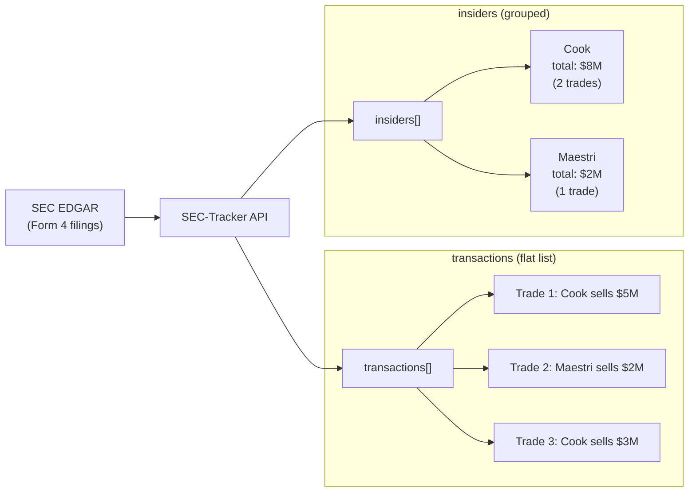

# SEC Filing Tracker - Technical Walkthrough

> **For Integration Partners**: Complete API documentation for SEC-Tracker v2.0

---

## Table of Contents

1. [Quick Start](#quick-start)
2. [REST API Reference](#rest-api-reference)
3. [Authentication](#authentication)
4. [Scaling Architecture](#scaling-architecture)
5. [Legacy CLI](#legacy-cli)

---

## Quick Start

### API Server

```bash
# Install dependencies
pip install -r requirements.txt

# Start local dev stack (PostgreSQL + Redis + API)
# NOTE: `docker-compose.dev.yml` is for development only (it exposes DB/Redis ports).
docker-compose -f docker-compose.dev.yml up -d

# Run migrations
alembic upgrade head
```

API docs: `http://localhost:8080/docs`

### Docker (Full Stack)

```bash
# Production stack (nginx + API + DB + Redis)
# Required env vars: DB_PASSWORD, JWT_SECRET_KEY, SEC_USER_AGENT
# TLS certs expected: ssl/fullchain.pem, ssl/privkey.pem
python scripts/preflight.py
docker-compose up -d --scale api=4

# With monitoring
docker-compose --profile monitoring up -d

# With background workers (Celery)
docker-compose --profile with-worker up -d
```

---

## REST API Reference

### Authentication

| Endpoint | Method | Body | Response |
|----------|--------|------|----------|
| `/api/v1/auth/register` | POST | `{email, password}` | `{id, email, ...}` |
| `/api/v1/auth/login` | POST | `{email, password}` | `{access_token, refresh_token}` |
| `/api/v1/auth/refresh` | POST | `{refresh_token}` | `{access_token, refresh_token}` |
| `/api/v1/auth/api-key` | POST | (Bearer token) | `{api_key}` *(returned once)* |
| `/api/v1/auth/api-key` | DELETE | (Bearer token) | *(204 No Content)* |
| `/api/v1/auth/me` | GET | (Bearer token or `X-API-Key`) | `{id, email, ...}` |

### Form 4 Insider Trading

> **`transactions` vs `insiders`**: Both contain the same trades.  
> - `transactions` = flat chronological list (for feeds/filtering)  
> - `insiders` = grouped by person with aggregated totals (for per-insider analysis)



```bash
# Get company insider activity
GET /api/v1/form4/{ticker}?days=30&count=50

# Response
{
  "ticker": "AAPL",
  "company_name": "Apple Inc.",
  "cik": "0000320193",
  "transactions": [
    {
      "date": "2026-01-15",
      "owner_name": "Tim Cook",
      "role": "CEO",
      "transaction_type": "sell",
      "is_planned": true,
      "shares": 50000,
      "price": 195.50,
      "amount": 9775000.00,
      "accession_number": "0001234567-26-000123"
    }
  ],
  "insiders": [
    {
      "owner_name": "Tim Cook",
      "role": "CEO",
      "transactions": [...],
      "total_buys": 0,
      "total_sells": 9775000.00,
      "net": -9775000.00
    }
  ],
  "summary": {
    "ticker": "AAPL",
    "company_name": "Apple Inc.",
    "total_buys": 5000000,
    "total_sells": 2000000,
    "net": 3000000,
    "buy_count": 5,
    "sell_count": 2,
    "period_days": 30,
    "last_updated": "2026-01-29T12:00:00Z"
  },
  "last_updated": "2026-01-29T12:00:00Z",
  "cache_hit": false
}
```

```bash
# Market-wide activity
GET /api/v1/form4/

# Response
{
  "companies": [
    {
      "ticker": "NVDA",
      "company_name": "NVIDIA Corporation",
      "date_range": "2025-12-30 to 2026-01-29",
      "buy_count": 3,
      "sell_count": 1,
      "total_buys": 15000000,
      "total_sells": 2000000,
      "net": 13000000,
      "signal": "↑",
      "top_insiders": ["Jensen Huang", "Colette Kress"]
    }
  ],
  "total_companies": 50,
  "buying_companies": 30,
  "selling_companies": 20,
  "total_transactions": 125,
  "last_updated": "2026-01-29T12:00:00Z",
  "filters_applied": {}
}
```

### Tracking

```bash
# Start tracking job (requires auth)
POST /api/v1/track/
{
  "ticker": "AAPL",
  "forms": ["10-K", "8-K"]
}

# Response
{
  "job_id": "abc123",
  "status": "queued"
}
```

```bash
# Check job status
GET /api/v1/track/job/{job_id}

# Response
{
  "job_id": "abc123",
  "status": "complete",
  "result": {...}
}
```

```bash
# Filing history (scoped to the current user)
GET /api/v1/track/history?limit=50&offset=0&ticker=AAPL&form_type=8-K
```

```bash
# Request analysis for a specific filing (requires auth)
# Optional: force a specific model slot (1-9)
POST /api/v1/track/analyze/{filing_id}?force=false&model_slot=2
```

> AI analysis requires `OPENROUTER_API_KEY`. To enable model rotation, set either `OPENROUTER_MODEL_ROTATION` (comma-separated) or `OPENROUTER_MODEL_SLOT_1..9`.
> Per-request override: pass `model=provider/model-id` (overrides both slot and rotation).

### Watchlist

```bash
# Get user watchlist (requires auth)
GET /api/v1/watchlist/

# Add to watchlist
POST /api/v1/watchlist/
{"ticker": "NVDA"}

# Remove from watchlist
DELETE /api/v1/watchlist/{ticker}

# Public company search
GET /api/v1/watchlist/search?q=apple&limit=10
```

### Health Check

```bash
GET /api/v1/health

{
  "status": "healthy",
  "database": "connected",
  "redis": "connected"
}
```

---

## Authentication

### JWT Tokens

```bash
# Get token
curl -X POST http://localhost:8080/api/v1/auth/login \
  -H "Content-Type: application/json" \
  -d '{"email": "user@example.com", "password": "secret"}'

# Use token
curl http://localhost:8080/api/v1/watchlist/ \
  -H "Authorization: Bearer <access_token>"
```

### API Keys

```bash
# Generate API key
curl -X POST http://localhost:8080/api/v1/auth/api-key \
  -H "Authorization: Bearer <access_token>"

# Use API key (auth-required endpoints accept either JWT or X-API-Key)
curl http://localhost:8080/api/v1/watchlist/ \
  -H "X-API-Key: <api_key>"
```

---

## Scaling Architecture

### Million-User Configuration

| Component | Config | Purpose |
|-----------|--------|---------|
| **PostgreSQL** | 500 max_connections, 2GB shared_buffers | High-concurrency DB |
| **Redis** | 2GB maxmemory, LRU eviction | Rate limiting + cache |
| **API** | 4 replicas, configurable DB/Redis pools | Horizontal scaling |
| **Nginx** | 10k connections/worker, TLS | Load balancing |

### Deploy Command

```bash
# Start with 4 API replicas
python scripts/preflight.py
docker-compose up -d --scale api=4

# With monitoring
docker-compose --profile monitoring up -d

# With workers
docker-compose --profile with-worker up -d
```

### Rate Limits

| Tier | Per Minute | Per Hour | Burst |
|------|------------|----------|-------|
| Default | 60 | 1000 | 10/sec |

---

## Legacy CLI

The CLI still works for local usage:

```bash
python run.py track AAPL           # Track company filings
python run.py form4 NVDA -r 20     # Insider trading
python run.py latest 50            # Market-wide activity
python run.py monitor --json       # System status
```

---

## Module Summary

| Layer | Modules |
|-------|---------|
| **API** | `api/main.py`, `api/routes/`, `api/middleware/` |
| **Services** | `services/auth_service.py`, `form4_service.py`, `tracking_service.py` |
| **Models** | `models/user.py`, `filing.py`, `transaction.py` |
| **Database** | `db/session.py`, `db/migrations/` |
| **Cache** | `cache/redis_client.py` |
| **Core** | `core/tracker.py`, `scraper.py`, `analyzer.py` |
